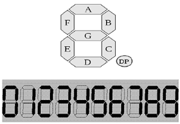
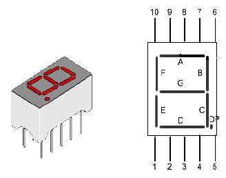
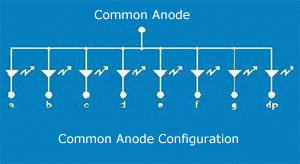
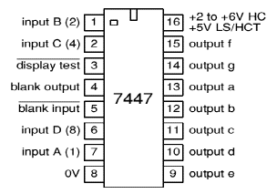
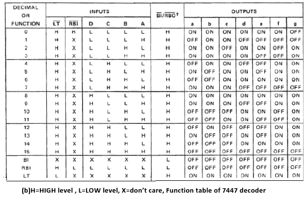
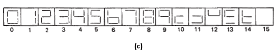
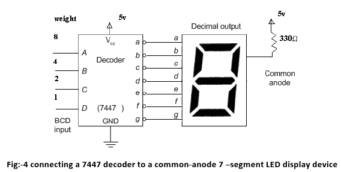
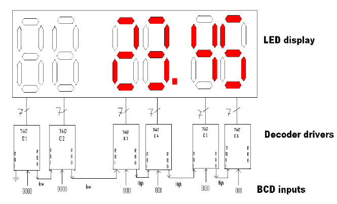

## Inroduction 

## About the Experiment

- This experiment enables a student to learn
- How to display decimal numbers 0-9 on a 7-segment LED display
- How to display a blank (making all the segments off)
- How to test the inputs LT (lamp test), ripple blanking input (RBI) and blanking input / ripple blanking output (BI/RBO) of TTL 7447 BCD-to-7-segment decoder
- How to blank out the leading 0s in a multiple digit display
           <!---->

### Theory

#### The result of a processing unit needs to be conveniently displayed to a user for its proper interpretation. The seven-segment LED display is a very common output device used to display decimal numbers. The seven segments of the display are labeled as a to g as shown in Figure 1(a). Displays representing decimal numbers from 0 to 9 are depicted in Figure 1(b). For example, segments a, b, d, e, and g should be lit up to display decimal Of the several common seven-segment display packages available, generally the common-anode type display is predominantly used in engineering institutions. A typical 10-pin LED common-anode display package, its pin diagram and internal connections are shown in Figure

 

                            

				
 
                             
                            Figure 1
                             
                             

				
				

                              
                             Figure 2(a) & 2(b)
                              
                             

				
				

                              
                             Figure 2(c)
                              
                              

  
 
     Fig:-2 . (a) 10 pin single-digit package    (b) pin out diagram  (c) Internal connection of common-anode LED package

 
 

#### It may be noted that the outputs of logic computation are normally available in binary form, which needs to be translated to seven-segment display code that causes appropriate segments on LED display to be lit up. One therefore needs a decoder in order to work with 7-segment LED display devices. Commercially available TTL 7447 BCD-to-seven segment decoder/driver, logic symbol of which is shown in Figure 3(a), can be conveniently used for controlling a common-anode type LED display device. The BCD number to be decoded is applied to the inputs D, C, B, and A. When the lamp test input (LT) is driven low, all the segments (a to g) are made to glow as all the seven outputs a to g go low. When the blanking input (BI) is made low, all the segments go off as all the seven outputs a to g go high. If driven low, the ripple-blanking input (RBI) darkens the display only when DCBA=LLLL (L=LOW). When the RBI input becomes active, the BI/RBO behaves like a ripple-blanking output (RBO) and becomes low. Note that the seven outputs of 7447 IC are all active low outputs.

                            

				
				
 
                             
                            Figure 3(a)
                             
                             

				
				

                              
                             Figure 3(b)
                              
                             

				
				

                              
                             Figure 3(c)
                              
                              
                             3.(a) Logic symbol for 7447 decoder IC   (b) Function Table of 7447 decoder    (c) Display produce for different combination of D,C,B,A inputs of 7447 decoder
                    

#### The operation of 7447 decoder/driver IC is given in complete detail by the function table shown in Figure 3(b). The decimal displays generated by the 7447 decoder are shown in Figure 3(c). figure.

#### It may be noted that invalid BCD inputs (corresponding to the decimal numbers 10, 11, 12, 12, 14, and 15) can produce distinct outputs through the 7447 decoder. The 7447 decoder is typically connected to a common-anode 7-segment LED display device as shown in Figure 4. The presence of the current-limiting 330 Ω resistance between the power supply and the common anode terminal of the LED block avoids the need to connect seven resistors between the outputs a-g of the decoder and the corresponding cathode terminals of the LED block.figure.

                            

				
				
 
                            

                            
                            
 

#### Applications like calculator require that the leading zeros be blanked out. Figure 5 shows the use of several 7447 decoder/drivers controlling a group of six LED displays as in a cash register. The present inputs to the six decoders are shown towards the bottom of Figure 5. The current BCD input is 0000 0000 0010 0011 0100 0101 (002345 in decimal). On blanking of the two left zeros, the display should read 23.45. Blanking of the leading 0s is taken care of by connecting the RBI and RBO terminals of pairs of 7447 decoder ICs as shown in Figure 5.Inspecting from left to right in Figure 5, note that RBI input terminal of IC1 is grounded. As its BCD input is 0000, the display is blanked out. Also, the RBO output of IC1, which is made to go low, is connected to the RBI input of IC2. As BCD input of IC2 is 0000, and RBI is low, its display is also banked out. This makes RBO of IC2 low, and this low level is passed to RBI of IC3. However, as BCD input of IC3 is 0010 (non-zero), display of IC3 is not blank. Thus RBO of IC3 is high, and this high level is passed to RBI of IC4. Note that once the displays to the right of IC2 are non-blank, even if some BCD input appears as 0000, the 0 will be displayed and not blanked out, for the RBI input will not be activated due to the nature of the connections between any two neighboring ICs figure.
  
                            

                            

				
				
 
                             
                            Figure 5
                             

                            
                        

                    </section>